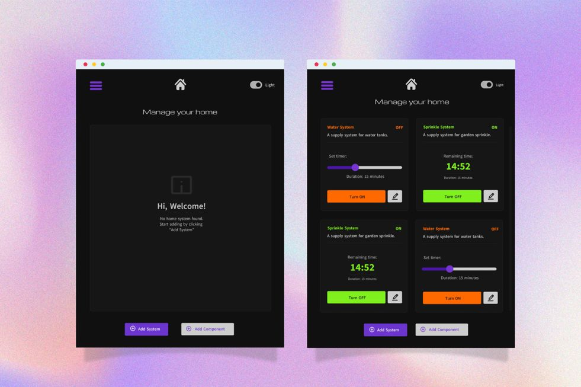

# IoT device manager

Dependencies:
- [Arduino-cli](https://arduino.github.io/arduino-cli/latest/installation/)
- [Docker](https://docs.docker.com/engine/install/)
- [Arduino board](https://store.arduino.cc/arduino-mega-2560-rev3)
- [Ethernet shield](https://store.arduino.cc/arduino-ethernet-shield-2)
- [MQTT broker](https://mosquitto.org/download/)


## How to use

### Setup

Clone the repository:

```bash
  git clone https://github.com/n1md7/mqtt-client.git IoT-device-manager
```

Run **MQTT** broker:

```bash
  docker compose up
  # If you don't want WebBased UI, run:
  docker compose up mqtt-server
```

Run **backend** service

```bash
  cd ./manager
  nvm use
  npm install
  npm run start:dev
```

Run **node** client
```bash
  cd ./node-client
  # D0001 sample device
  node index.js -c D0001
```
Run **frontend** service

```bash
  cd ./web-client
  npm install
  npm run dev
```

#### Arduino
Refer to the [README.md](clients/Arduino/SWITCH/README.md) in the `arduino-client` directory.

#### Device manager
Refer to the [README.md](clients/node-client/README.md) in the `node-client` directory.

Prototype available here: [@Behance:kaeri-gg](https://www.behance.net/gallery/219918315/IoT-Home-Automation-System-UI)



