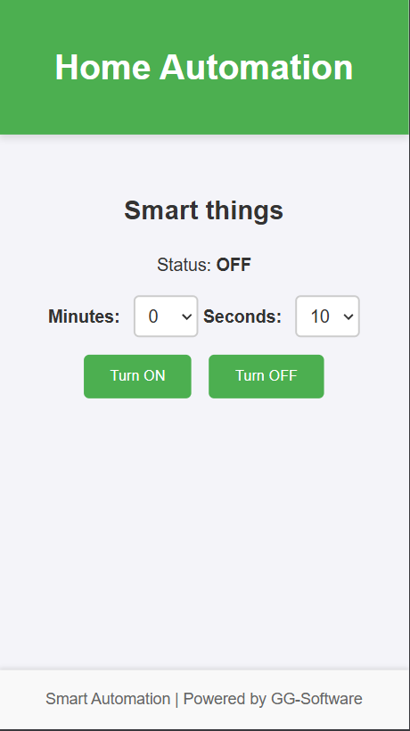
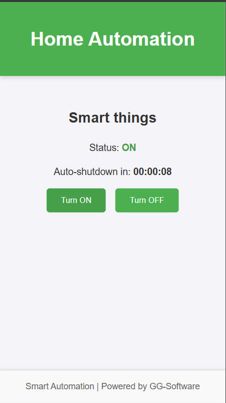
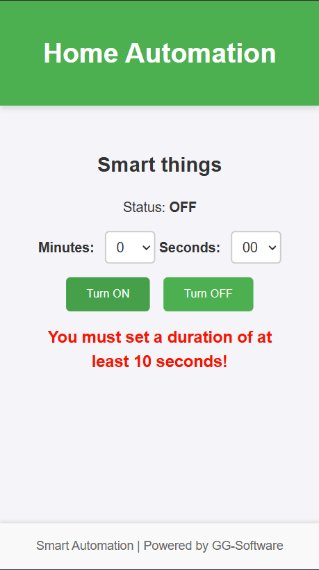

# Nodemcu simple webserver

This is a basic code for `esp/nodemcu` (`ESP8622`).

It has a basic UI to control an external Device.

It supports timer/countdown feature to auto turn of the attached device.

## Getting started

Please follow official documentation to get
started [here](https://www.moddable.com/documentation/Moddable%20SDK%20-%20Getting%20Started)

## Write code to the device

1. Open you terminal tool for VS 2022. (Not regular CMD/Terminal)
2. Navigate to this directory
3. Compile and transfer the code to the target device

```bash
mcconfig -d -m -p esp/nodemcu ssid="YOUR-WIFI-NAME" password="PASSWORD-HERE"
```

Config can be overridden, but it defaults to manifest values

```bash
mcconfig -d -m -p esp/nodemcu ssid="YOUR-WIFI-NAME" password="PASSWORD-HERE" name="My device" description="My device description" code="D0001"
```

### Screenshots



