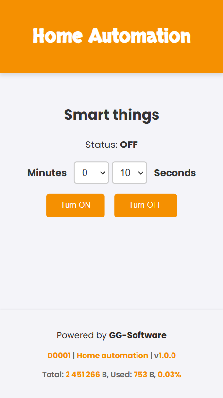
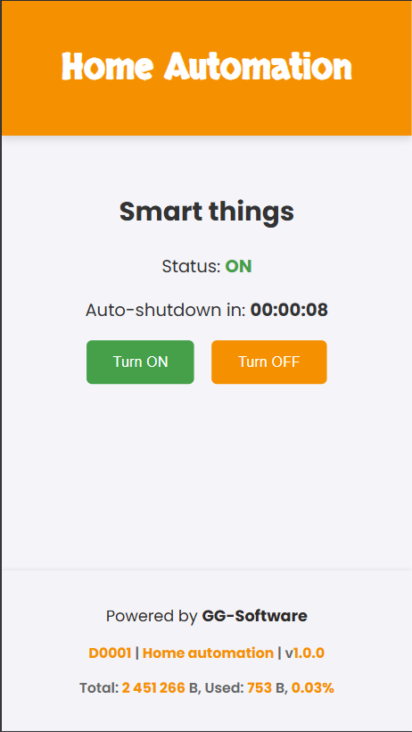
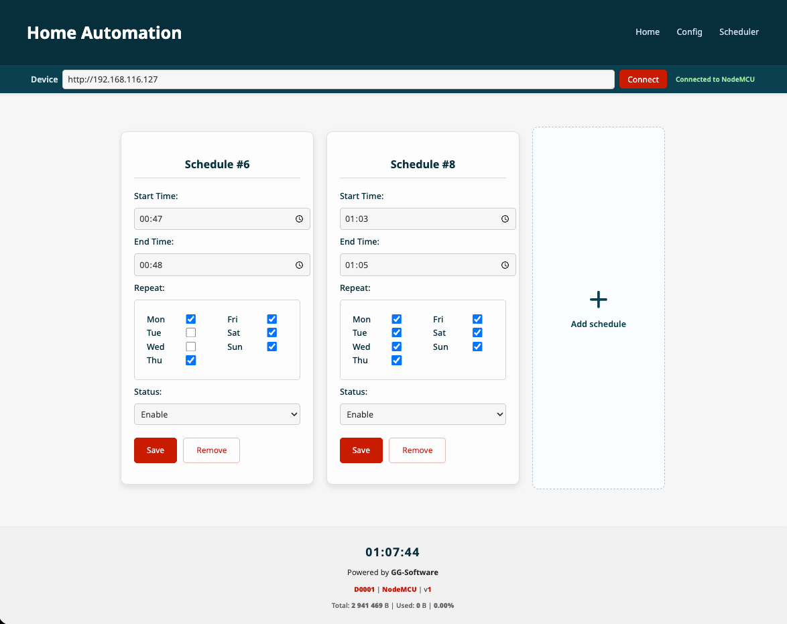

# ESP Web Server

A tiny, **Express-like web server** for the **ESP8266 / ESP32**, built on the
[Moddable SDK](https://www.moddable.com/) (XS JavaScript runtime). It runs
directly on the microcontroller and exposes a small REST API — plus a static UI —
to control relays/LEDs (**switches**) and run time-based automations
(**schedules**).

It is deliberately a *limited* HTTP framework: no dynamic URL params, no
middleware stack, no streaming uploads — just enough of the Express ergonomics
(routers, a request context, chained verbs) to be productive within the RAM and
flash budget of an ESP8266.

> Built and flashed with Moddable's `mcconfig`. TypeScript is transpiled per-file
> on the way to the device.

## Table of Contents

- [Features](#features)
- [How it works](#how-it-works)
- [Project structure](#project-structure)
- [Getting started](#getting-started)
- [Flashing to the device](#flashing-to-the-device)
- [TypeScript](#typescript)
- [REST API](#rest-api)
- [Development](#development)
- [Documentation](#documentation)
- [Screenshots](#screenshots)

## Features

- 🌐 **Express-like router** — `new Router("/switches").get(...).post(...)` with
  chained HTTP verbs and a per-request `ctx` (body, query params, helpers).
- 🔌 **Switches** — register digital output pins and drive them on/off, manually
  or on a timer.
- ⏰ **Scheduler** — daily `[start, end)` windows per weekday that automatically
  drive a switch.
- 📦 **Static file serving** — UI assets are streamed from flash in small chunks
  to stay within RAM limits.
- ✅ **Layered validation** — routes assert request *shape*; controllers own the
  *business rules*; a single handler turns thrown errors into `400`s.
- 🧪 **Unit tested** with [Vitest](https://vitest.dev/) and type-checked with
  `tsc`.

## How it works

The request flow is intentionally simple and mirrors a classic MVC split:

```
HTTP request
   │
   ▼
Express (server/express.ts)      parse query/body, attach ctx helpers,
   │                             dispatch by route + method, catch → 400
   ▼
Router (server/router.ts)        namespaced routes, chained verbs
   │
   ▼
Route handler (routes/*.ts)      validate request SHAPE via assert* helpers
   │                             (assertObject, assertNumber, ctx.intParam, …)
   ▼
Controller (controllers/*.ts)    enforce BUSINESS rules (allowed pins, etc.)
   │
   ▼
Manager (managers/*.ts)          in-memory state + persistence to flash
```

- **Routes** only check that the request is well-formed (right keys, right
  types, parseable query params). They throw on bad input.
- **Controllers** hold domain rules (e.g. a schedule may only drive an enabled
  switch) and never touch the transport layer.
- **A single catch** in `Express` converts any thrown error into
  `400 { "message": "<reason>" }`, so handlers stay free of `try/catch`.

## Project structure

```
src/
├── main.ts              # entry point — mounts routers, starts the server
├── server/              # the Express-like framework (Express, Router, Context)
├── routes/              # switches.ts, schedules.ts — request-shape validation
├── controllers/         # business logic, no transport concerns
├── managers/            # stateful collections (switches, schedules)
├── services/            # device primitives (Switch, Schedule, logger)
├── storages/            # persistence helpers (ids, unique-id)
└── utils/               # validations (assert* / is*), http, env, interval
docs/                    # rest.yaml (OpenAPI), mqtt.md
tests/                   # Vitest unit tests + mocks
```

## Getting started

Follow the official Moddable guide to set up the toolchain and SDK first:
[Moddable SDK — Getting Started](https://www.moddable.com/documentation/Moddable%20SDK%20-%20Getting%20Started).

Then install the dev dependencies (used for type-checking and tests, not for the
device build):

```bash
npm install
```

## Flashing to the device

1. Open the terminal configured for your Moddable toolchain (on Windows, the
   **VS 2022** developer terminal — not a regular CMD/PowerShell).
2. Navigate to this directory.
3. Compile and transfer the code to the target device:

```bash
mcconfig -d -m -p esp/nodemcu ssid="YOUR-WIFI-NAME" password="PASSWORD-HERE"
```

Configuration can be overridden on the command line; otherwise it defaults to the
`manifest.json` values:

```bash
mcconfig -d -m -p esp/nodemcu \
  ssid="YOUR-WIFI-NAME" \
  password="PASSWORD-HERE" \
  name="My device" \
  code="D0001" \
  version="1.0.0" \
  environment="development" \
  description="My device description"
```

> **Note:** To generate a release build, omit both `-d` and `-i` from the
> command line.

Targets: `esp/nodemcu` (ESP8266) is the primary target; ESP32 builds work with
the matching Moddable platform (e.g. `-p esp32/<board>`).

## TypeScript

The Moddable build tools (`mcconfig` / `xsc`) transpile TypeScript natively, so
`.ts` files in `src/` are picked up automatically by the existing manifest glob
(`./src/*`) — no manifest changes needed. You can migrate file-by-file; `.js` and
`.ts` coexist.

> [!IMPORTANT]
> The device build **only strips types — it does not type-check**. A type error
> will not fail `mcconfig`. Run the type checker yourself:

```bash
npm run typecheck        # one-off check (tsc --noEmit)
npm run typecheck:watch  # keep it running while developing
```

### Constraints (Moddable transpiles per-file, onto a constrained ESP8266)

- **No `enum` / `const enum`** — `enum` emits a runtime object (flash + RAM cost),
  and `const enum` requires cross-file type info that per-file transpilation can't
  resolve. Use `const` union types instead, e.g. `type Pin = 'D0' | 'D1'`, or a
  plain `const` object.
- **No `namespace` and no decorators** — both rely on whole-program info / emit
  runtime code; avoid them.
- **Use `import type`** for type-only imports so nothing survives transpilation.
- `tsconfig.json` sets `isolatedModules` + `verbatimModuleSyntax`, so the type
  checker will flag any of the above before it reaches the device.

Globals such as `Timer`, `Net`, `Digital`, `Preference`, and `File` are typed via
`@moddable/typings` (already a devDependency).

## REST API

All routes are mounted under the `/api` prefix and respond with JSON. Resource
ids are passed via the query string (the router has no dynamic URL params).
Errors return the relevant `4xx` with a `{ "message": "<reason>" }` body.

| Method   | Path                    | Description                                   |
| -------- | ----------------------- | --------------------------------------------- |
| `GET`    | `/api/switches`         | List switches                                 |
| `POST`   | `/api/switches`         | Create a switch (`digitalPin`, `control`)     |
| `PATCH`  | `/api/switches?pin=`    | Update a switch's control signal              |
| `DELETE` | `/api/switches?pin=`    | Delete a switch                               |
| `POST`   | `/api/switches/control` | Drive a switch (`action: Start \| Stop`)      |
| `GET`    | `/api/schedules`        | List schedules                                |
| `POST`   | `/api/schedules`        | Create a schedule                             |
| `PATCH`  | `/api/schedules?id=`    | Update a schedule (partial)                   |
| `DELETE` | `/api/schedules?id=`    | Delete a schedule                             |
| `GET`    | `/api/device`           | Device identity (`name`, `code`, `version`) + clock |

**Pins** accept digital pins `1`–`8`; **control** is `0` (LOW) or `1` (HIGH).

Example — turn a relay on for ~10 minutes. `stopAt` is an epoch timestamp (ms,
min ~10s ahead); the device arms a timer and turns the switch off automatically at
that time (surfaced as `stopsAt` when you `GET /api/switches`):

```bash
curl -X POST http://192.168.1.2/api/switches/control \
  -H 'Content-Type: application/json' \
  -d '{ "digitalPin": 3, "action": "Start", "stopAt": 1740858186087 }'
```

Example — create a weekday morning schedule on pin 3:

```bash
curl -X POST http://192.168.1.2/api/schedules \
  -H 'Content-Type: application/json' \
  -d '{
        "isActive": true,
        "controlPin": 3,
        "startTime": { "hh": 7, "mm": 0, "ss": 0 },
        "endTime":   { "hh": 8, "mm": 30, "ss": 0 },
        "weekdays":  { "sun": 0, "mon": 1, "tue": 1, "wed": 1, "thu": 1, "fri": 1, "sat": 0 }
      }'
```

The full contract (request/response schemas, status codes, examples) lives in the
OpenAPI spec: [`docs/rest.yaml`](docs/rest.yaml). Paste it into
[editor.swagger.io](https://editor.swagger.io/) to browse it interactively.

## Development

```bash
npm run typecheck   # type-check without emitting
npm test            # run the Vitest suite
npm run test:cov    # run tests with coverage
```

## Documentation

- REST API — [`docs/rest.yaml`](docs/rest.yaml) (OpenAPI 3.0)
- MQTT — [`docs/mqtt.yaml`](docs/mqtt.yaml)

## Screenshots




